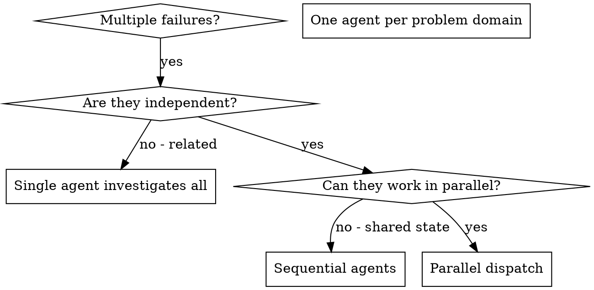

# Dispatching Parallel Agents

"Use when facing 2+ independent tasks that can be worked on without shared state or sequential dependencies"

## Autonomous Capabilities

- Autonomous operation without manual intervention
- Intelligent task planning and execution
- Self-monitoring and error recovery
- Multi-step workflow orchestration

## Use Cases

- Automated task execution
- Complex workflow management
- Intelligent decision making
- Autonomous problem solving

## Workflow

1. Initialize agent with task parameters
2. Analyze task requirements
3. Execute autonomous workflow
4. Monitor progress and handle errors
5. Report results and completion status

## Source

This autonomous agent was adopted from: `antigravity-awesome-skills/skills/dispatching-parallel-agents/SKILL.md`

## Original Content

---
name: dispatching-parallel-agents
description: "Use when facing 2+ independent tasks that can be worked on without shared state or sequential dependencies"
risk: unknown
source: community
date_added: "2026-02-27"
---

# Dispatching Parallel Agents

## Overview

When you have multiple unrelated failures (different test files, different subsystems, different bugs), investigating them sequentially wastes time. Each investigation is independent and can happen in parallel.

**Core principle:** Dispatch one agent per independent problem domain. Let them work concurrently.

## When to Use

**Use when:**
- 3+ test files failing with different root causes
- Multiple subsystems broken independently
- Each problem can be understood without context from others
- No shared state between investigations

**Don't use when:**
- Failures are related (fix one might fix others)
- Need to understand full system state
- Agents would interfere with each other

## The Pattern

### 1. Identify Independent Domains

Group failures by what's broken:
- File A tests: Tool approval flow
- File B tests: Batch completion behavior
- File C tests: Abort functionality

Each domain is independent - fixing tool approval doesn't affect abort tests.

### 2. Create Focused Agent Tasks

E
