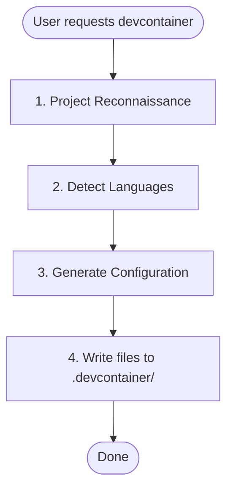

# devcontainer-setup

Creates devcontainers with Claude Code, language-specific tooling (Python/Node/Rust/Go), and persistent volumes. Use when adding devcontainer support to a project, setting up isolated development envi

## When to Use

- Use this skill when working on tasks related to devcontainer setup
- Apply best practices from antigravity-awesome-skills

## Workflow

## Source

Adopted from: antigravity-awesome-skills
